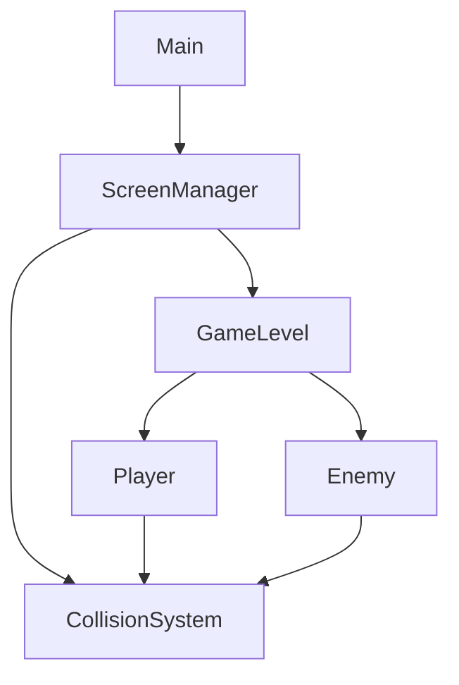
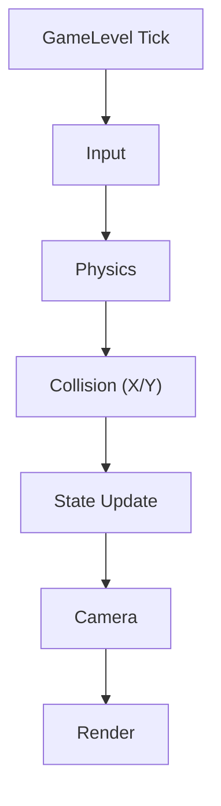

# ConsoleMario

콘솔 환경에서 마리오의 핵심 플레이(이동/점프/충돌/상호작용)를 구현한 **2D 플랫폼 게임**입니다.  
**3개 스테이지(1-1 / 1-2 / 1-3) + 클리어까지** 이어지는 게임 루프를 완성했습니다.

> 🎥 Gameplay: https://www.youtube.com/watch?v=IOTGzlAueAQ

> 📦 Release: https://github.com/yj9809/ConsoleMario/releases/tag/ConsoleMario

---

## Overview
- **Frame Pipeline**을 고정해 기능 추가와 디버깅이 가능한 구조로 설계했습니다.  
  `Input → Physics → Collision → State → Camera → Render`
- **Goal('G' 깃발) 트리거** 충돌 시 다음 맵/게임 클리어로 전환됩니다.
- 플레이어가 화면 중앙을 오른쪽으로 넘어가면 카메라가 따라가고, 왼쪽 이동 시 카메라는 고정됩니다. *(Right-only follow)*

---

## Key Features
- **Tilemap 로딩(.txt)** 기반 스테이지 구성
- **AABB 충돌**로 적/벽/코인 상호작용 구현
- **X/Y 축 분리 충돌 처리**로 바닥·벽·천장 판정 안정화
- **플레이어 상태 머신**(Idle/Jumping/Falling/Crash/Clear/Death) 기반 동작 제어
- **스크롤 카메라** + **스테이지 전환** + **엔딩**

---

## Controls
> 프로젝트에 맞게 실제 키로 수정하세요.
- Move Left / Right: `<- , ->` (방향키)
- Jump: `Space`
- Select / Confirm: `Enter`
- Quit: `Esc`

---

## How to Run
### Option A) Run Release (추천)
1. Releases에서 최신 버전 다운로드
2. 실행 파일 실행

### Option B) Build from Source
- IDE: Visual Studio 2022/2026
- Build: `x64 / Debug` 또는 `Release`
- 실행: 빌드 후 생성된 exe 실행
---

## Technical Highlights (What I solved)
### 1) Ceiling collision bug (Jump → Y fixed)
- 문제: 점프(상승) 중 천장 충돌 후 Fall로 전환되지 않아 Y축이 고정되는 현상
- 해결: 상승 상태에서 천장 충돌 시 **Fall로 즉시 전환**하도록 상태 전이 규칙 정리

### 2) Moving platform ride
- 문제: 이동 플랫폼 위에서 플레이어가 함께 이동하지 않음
- 해결: 플랫폼 이동량(delta)을 계산해 **플랫폼 위에 있을 때만 delta를 플레이어에 적용**

### 3) Landing bug (Falling stuck)
- 문제: 점프 후/단차 하강 후 **착지 판정이 간헐적으로 누락되어 Falling이 지속**됨
- 해결: 바닥 감지 시 **Falling → Idle 복귀 + velocityY=0 초기화**, 수직 물리 **고정 스텝/서브스텝 충돌 검사**로 안정화

### 4) Level transition crash (As<Coin>() access violation)
- 문제: 맵 클리어 후 레벨 교체 시 **As<Coin>()에서 읽기 액세스 위반** 발생
- 해결: `OnDestroy()`에서 **충돌 리스너/콜라이더 정리(ClearListener, OnDisable)** 를 강제해 **댕글링 포인터** 제거

---

## Architecture
1) System Overview
- Main에서 ScreenManager가 화면(메뉴/게임)을 관리하고, GameLevel이 게임 오브젝트(Player/Enemy)를 업데이트합니다.
- 충돌은 CollisionSystem이 담당하며, 각 Actor는 자신의 CollisionComponent 정보를 기반으로 충돌을 등록/검사합니다.

2) Frame Pipeline

- GameLevel Tick에서 아래 순서로 업데이트됩니다.
Input → Physics → Collision(X/Y) → State → Camera → Render

